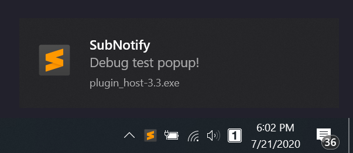

[![Donate via PayPal][donate-image]][donate-link]
[![Package Control Downloads][pc-image]][pc-link]
![License][license-image]
# SubNotify

Sublime Text notification plugin (Windows|OSX|Linux)

# Features

-   Native windows taskbar bubble notifications.
-   OSX Notification Support via `terminal-notifier` https://github.com/julienXX/terminal-notifier.
-   Linux support via `notify-send`.

# Documentation

http://facelessuser.github.io/SubNotify/

# License

SubNotify is released under the MIT license.

[pc-image]: https://img.shields.io/packagecontrol/dt/SubNotify.svg?labelColor=333333&logo=sublime%20text
[pc-link]: https://packagecontrol.io/packages/SubNotify
[license-image]: https://img.shields.io/badge/license-MIT-blue.svg?labelColor=333333
[donate-image]: https://img.shields.io/badge/Donate-PayPal-3fabd1?logo=paypal
[donate-link]: https://www.paypal.me/facelessuser
